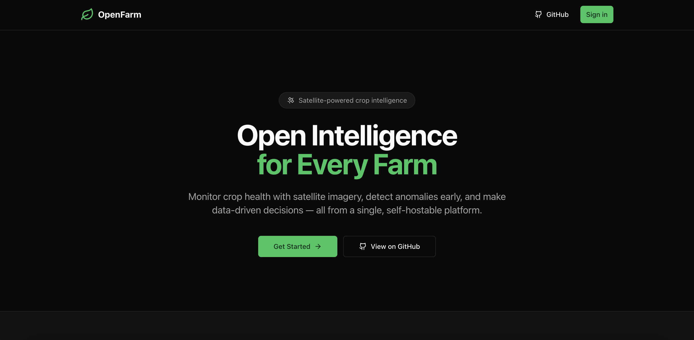
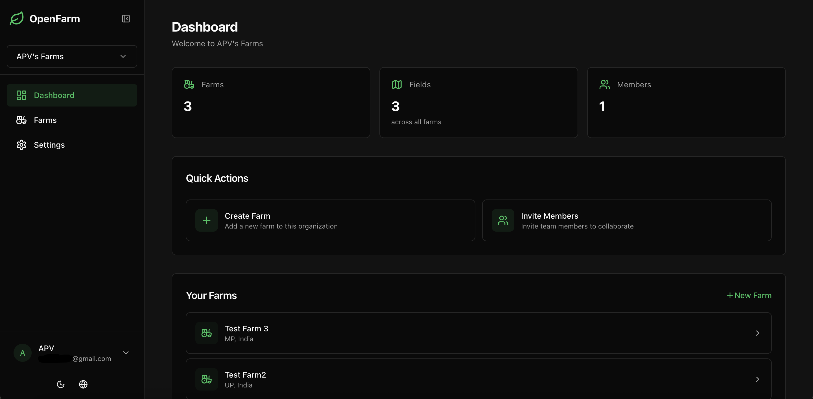

<div align="center">

# agric-satellite-analysis

### 农业卫星分析 / Agricultural Satellite Analysis

基于开源 [OpenFarm](https://github.com/superzero11/OpenFarm)（BSD-3-Clause）的作物遥感与地块智能分析平台。

An OpenFarm-based, self-hostable crop intelligence stack: Sentinel-2, weather, and soil fused into explainable per-field insights.

[](https://github.com/520LuoTianxu/agric-satellite-analysis/actions/workflows/ci.yml)
[](LICENSE)

<p>
  
  
</p>

</div>

This repository is a fork of **[OpenFarm](https://github.com/superzero11/OpenFarm)** by [superzero11](https://github.com/superzero11). See [NOTICE](NOTICE) and [LICENSE](LICENSE). Default UI locale is **简体中文 (`zh`)**; English (`en`) and Spanish (`es`) remain available.

本仓库第一版在 OpenFarm 全栈之上加入：

- Google OAuth 登录，以及可选 Demo 登录（`ENABLE_DEMO_LOGIN`）
- next-intl 简体中文（默认语言 `zh`）

---

## Why this stack / 为什么用这套栈

- Self-hostable services: Next.js ↔ FastAPI ↔ TiTiler ↔ MinIO ↔ PostGIS
- Vegetation indices from Sentinel-2: NDVI, EVI, SAVI, NDWI, with 24-month backfill
- ML field-boundary detection (FTW) with review workflow
- Daily weather (Open-Meteo) plus agricultural indices (GDD, water balance, drought)
- Soil intelligence from SoilGrids (global, 250 m) and POLARIS (US, 30 m)
- Provenance: Element84 STAC → COG → TiTiler tiles
- Tenant isolation via `X-Org-Id` + JWT; RBAC (`owner` / `admin` / `member` / `viewer`)
- MapLibre + PMTiles (no Mapbox token), ECharts time series
- Permissive BSD-3-Clause license

## Prerequisites / 前置条件

- Docker + Docker Compose v2
- Node.js 20+ and npm 10+ (local web)
- Python 3.11+ and pip (local API)
- Google OAuth credentials for production login (`GOOGLE_CLIENT_ID`, `GOOGLE_CLIENT_SECRET`)

## Quick Start / 快速开始

```bash
cp .env.example .env
# Fill Google OAuth (see below) and generate secrets:
#   NEXTAUTH_SECRET:     openssl rand -base64 32
#   OPENFARM_JWT_SECRET: openssl rand -base64 64

docker compose -f docker-compose.yml -f docker-compose.dev.yml up --build
```

Do **not** commit `.env`. Only `.env.example` is in git.

| Service | URL | Purpose |
|---|---|---|
| Web (Next.js) | http://localhost:3000 | Frontend UI（默认中文） |
| API (FastAPI) | http://localhost:8000 | Backend API |
| API Docs | http://localhost:8000/docs | Swagger UI |
| TiTiler | http://localhost:8080 | COG tiles |
| MinIO Console | http://localhost:9001 | Object storage admin |

Health checks:

```bash
curl http://localhost:8000/healthz    # API
curl http://localhost:8080/healthz    # TiTiler
curl http://localhost:3000/api/health # Web
```

Production compose files stay as upstream: `docker-compose.yml` + `docker-compose.prod.yml` (Caddy). See [DEPLOYMENT.md](DEPLOYMENT.md).

## Authentication / 登录

### Google OAuth（默认登录方式）

NextAuth uses the Google provider. Create credentials in [Google Cloud Console](https://console.cloud.google.com/apis/credentials):

1. Create (or select) a project and enable the **Google+ API** / Google Identity.
2. **APIs & Services → Credentials → Create credentials → OAuth client ID**.
3. Application type: **Web application**.
4. Authorized JavaScript origins (local):
   - `http://localhost:3000`
5. Authorized redirect URIs (local):
   - `http://localhost:3000/api/auth/callback/google`
6. For a deployed host, add the same pair with `https://your-domain.com`.
7. Copy the client ID and secret into `.env`:

```bash
GOOGLE_CLIENT_ID=your-google-client-id
GOOGLE_CLIENT_SECRET=your-google-client-secret
NEXTAUTH_URL=http://localhost:3000   # or https://your-domain.com
NEXTAUTH_SECRET=$(openssl rand -base64 32)
```

OAuth consent screen: add your test users while the app is in **Testing**. The sign-in modal copy comes from i18n keys under `signInPage` (`apps/web/messages/{zh,en,es}.json`).

### Optional Demo login / 可选演示登录

Upstream OpenFarm is Google-only. This fork adds a NextAuth **Credentials** provider with id `demo`, gated by **both** flags:

```bash
ENABLE_DEMO_LOGIN=true
NEXT_PUBLIC_ENABLE_DEMO_LOGIN=true
```

- `ENABLE_DEMO_LOGIN` — server: register the `demo` provider and accept sign-in.
- `NEXT_PUBLIC_ENABLE_DEMO_LOGIN` — client: show the demo button (inlined at Next.js **build** time; change it then rebuild the web image).

Leave both `false` in production unless you want a shared demo user. After enabling, restart / rebuild `web`, then use **使用演示账户继续** / **Continue with demo account** on the sign-in modal.

## i18n / 国际化

| Locale | Prefix | Default |
|---|---|---|
| `zh` 简体中文 | `/` (no prefix) | **yes** |
| `en` English | `/en` | |
| `es` Español | `/es` | |

Messages: `apps/web/messages/{zh,en,es}.json`. Routing: `apps/web/src/i18n/routing.ts`. Switch languages with the globe control in the header / sidebar.


## Object storage / 对象存储（MinIO ↔ Aliyun OSS）

The API and Celery workers talk to object storage through `app.core.storage.get_storage()`, selected by `STORAGE_BACKEND`:

| `STORAGE_BACKEND` | Use case |
|---|---|
| `minio` (default) | Local / self-hosted MinIO (`MINIO_*`) |
| `oss` | Aliyun OSS (`OSS_*`) — e.g. S1/S2 parcel JSON under `OSS_PREFIX` |

```bash
# .env
STORAGE_BACKEND=minio   # or oss

# When STORAGE_BACKEND=oss (do not commit real secrets):
OSS_REGION=oss-cn-beijing
OSS_ENDPOINT=https://oss-cn-beijing.aliyuncs.com
OSS_ACCESS_KEY_ID=
OSS_ACCESS_KEY_SECRET=
OSS_BUCKET=agric-dev
OSS_PREFIX=s1s2_parcel/json/
```

Useful API routes (auth + `X-Org-Id` required):

- `GET /v1/storage/backend` — active backend / bucket / parcel prefix
- `GET /v1/storage/objects` — list keys
- `POST /v1/storage/parcel-products/pull` — fetch parcel JSON summary from the fixed prefix

Offline ingest tooling (no secrets): `scripts/s1s2_parcel_oss_pg/`.


## Agri schema (primary)

This fork treats the Aliyun **`agri`** PostgreSQL schema as the primary product model:

| Concept | Table | API |
| --- | --- | --- |
| 项目区 (~5km tile) | `agri.virtual_project_areas` | `GET /v1/agri/project-areas` |
| 地块 | `agri.land_parcels` (`boundary_geojson`) | `GET /v1/agri/lands/{land_id}` |
| S1/S2 产品时序 | `agri.parcel_scene_products` | `GET /v1/agri/lands/{land_id}/scenes` |

Seed / import: see [`scripts/agri_seed/README.md`](scripts/agri_seed/README.md) (`make agri-seed`).  
OpenFarm `/v1/farms` and `/v1/fields` remain available but are **legacy** for this product direction. Scene list APIs return S2 optical index averages and S1 VV/VH without `pixel_data` unless `?include_pixels=1`.

## Architecture / 架构

Same 3-layer OpenFarm architecture:

```
Layer C - Delivery:     Map UI · Reports · API
Layer B - Intelligence: Phenology · Anomaly · Soil-derived insights
Layer A - Observation:  Satellite · Weather · Soil · Boundaries
```

```
apps/web/       → Next.js 14 + NextAuth (Google + optional demo) + Tailwind + MapLibre
services/api/   → FastAPI + SQLAlchemy 2.0 (async) + Alembic + Celery
services/tiler/ → TiTiler COG tile server (shared JWT auth)
docker-compose.yml → Postgres/PostGIS, Redis, MinIO, API, workers, TiTiler, Web
```

See [ARCHITECTURE.md](ARCHITECTURE.md) for the upstream strategic document.

## Local development / 本地开发

### Frontend (`apps/web`)

```bash
cd apps/web
npm install
npm run dev          # start dev server
npm run lint         # ESLint
npm run type-check   # TypeScript (no emit)
npm run build        # production build
```

### Backend (`services/api`)

```bash
cd services/api
pip install -e ".[dev]"
alembic upgrade head
uvicorn app.main:app --reload --port 8000

ruff check .
ruff format --check .
```

## Quality & CI

- GitHub Actions: `.github/workflows/ci.yml` (env parity, i18n key parity, web lint/type-check, API ruff)
- Message files must share the same key tree: `python3 scripts/check-i18n-keys.py`

## Acknowledgements / 致谢

Core platform code, design, and pipeline come from **OpenFarm**:

- Upstream: https://github.com/superzero11/OpenFarm
- Live upstream demo: https://openfarm.earth

Data and imagery: Copernicus Sentinel-2 (ESA), Element 84 Earth Search, Open-Meteo, ISRIC SoilGrids, POLARIS, Fields of The World, OpenStreetMap / Protomaps.

## License

BSD-3-Clause — see [LICENSE](LICENSE) and [NOTICE](NOTICE).
