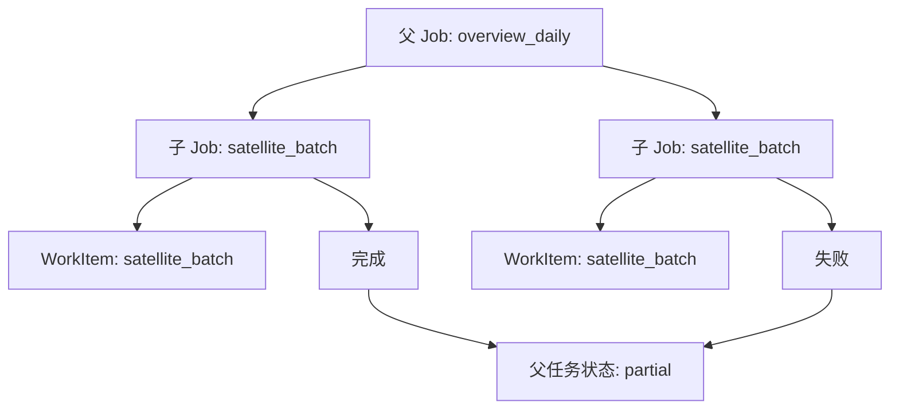

# 管理页执行任务层级设计

日期：2026-09-19。状态：已实现，待部署验证。

## 背景

管理员执行页原先直接展示 Job 和 WorkItem 平铺列表。全国态势每日任务实际是一棵任务树：`overview_daily` 是父 Job，`params_json.job_ids` 指向多个 `satellite_batch` 子 Job，下载机的 WorkItem 再通过 `payload.extras.job_id` 关联到对应子 Job。平铺展示会让同一批任务看起来像大量互不相关的小点，也无法判断父任务为什么仍在运行。

## 决策

- API 在 `/admin/ops/execution` 增加一级 `groups`，列表只返回父任务及子任务计数；原有 `jobs`、`work_items` 字段保留，兼容已有调用方。
- 增加 `/admin/ops/execution-groups/{group_id}`，按需返回父 Job、全部子 Job 和 WorkItem 的完整参数、进度、租约、结果与错误。
- 分组优先识别 `params_json.job_ids`、`params_json.overview_run_id`、通用 `parent_job_id`，WorkItem 识别顶层或 `extras` 中的 `job_id`/`parent_job_id`。没有父引用的历史记录保持为独立一级任务，不会被隐式合并。
- 有真实父 Job 时，一级状态以父 Job 为准。`partial` 是合法终态，表示子任务全部进入终态但至少有失败或取消；失败子任务不阻塞父任务汇总。
- 没有真实父 Job 的孤立 WorkItem 使用子项状态计算一级状态：仍有未终态时为 `pending`/`running`，全终态且混合成功失败时为 `partial`。
- 前端只展示一级任务，点击后打开弹窗；弹窗内分别列出子 Jobs 和子 WorkItems，并用折叠区显示每个子项的 JSON 参数、进度、负载、结果和错误。
- 前端集中维护任务类型翻译，已知英文类型显示中文；未知类型保留原始值，避免新任务上线后丢失诊断线索。

## 状态关系

父任务的 `partial` 不等于异常阻塞：它表示本次汇总已经可以生成，失败地块可以在后续补偿任务中重试。只有仍存在 `pending`、`running` 或缺失的预期子任务时，父任务才应保持未终态。

## 取舍与后续

当前版本兼容历史库结构，任务关系仍保存在 JSONB 中，因此管理接口需要读取任务行后在 API 侧构建分组。管理页是低频运维入口，现阶段优先保证历史数据可见和父子关系不丢失。

如果 Job/WorkItem 数量增长到全量扫描影响 10 秒刷新，应新增 `parent_job_id`、`root_job_id` 和相应索引，并在创建任务时同步写入；届时列表可以直接按父任务分页、按状态聚合，详情接口再读取子项。迁移完成前不应在前端按任务类型或地块 ID 猜测父子关系。

## 验证

- 后端测试覆盖父任务下同时存在成功、失败子 Job 和 WorkItem 的场景。
- 前端通过 TypeScript、Next.js lint 和三语言 key 一致性检查。
- 部署后应验证：全部子任务终态且含失败时父任务显示“部分完成”；仍有未终态时父任务继续显示运行中；点击父任务能看到所有子项及失败原因。

